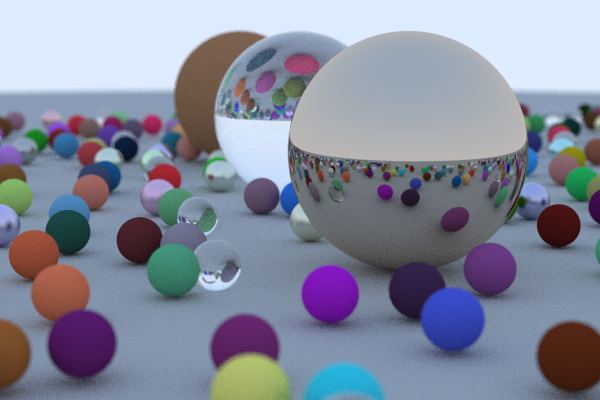

# Rayska
A simple ray tracer that does all ray calculations without external tools.

## Status
The project is still in an early state, and will be built upon in the future
### Sample render

## What's next?
Some ideas for further development, not necessarily in order of importance
- A rudimentary CLI for creating worlds and renders, before a GUI is created
- GUI
- Additional object types
- Reading .obj files
- Texture mapping
- Lights
